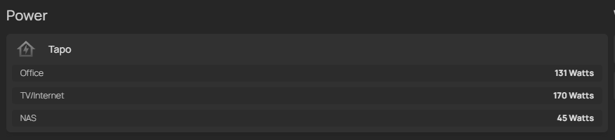

# Tapo Device Power REST API

A lightweight, **pure-Python** REST API for controlling Tapo smart devices and fetching their power data, packaged for Docker deployment.

My goal was to retrieve data usage for several Tapo smart plugs in 1 single response, to use in a [custom API](https://gethomepage.dev/widgets/services/customapi/) service widget in my [Homepage](https://gethomepage.dev/) dashboard:

### Syntax
```
- Power:
    - Tapo:
        icon: mdi-home-lightning-bolt-outline
        widgets:
            - type: customapi
              url:  http://<taporestsc_url>:5000/get_all_device_power
              refreshInterval: 5000 # in milliseconds
              display: dynamic-list
              mappings:
                    name: device
                    label: data.current_power
                    suffix: Watts
```
### Result


## Features

- One endpoint returning the current power of every configured device, plus a computed total
- Chained plugs: subtract one device's consumption from another's, so nothing is counted twice
- A REST surface for controlling and querying individual devices, documented automatically on `/docs`
- Speaks to devices **directly over your LAN** with [python-kasa](https://github.com/python-kasa/python-kasa) — no bundled binary, no sidecar process, no cloud round-trip
- Expired device sessions are re-established transparently instead of failing the request
- Dockerized, and architecture-independent

## Quick Start

### 1. Clone this Repository

```
git clone <this-repo-url>
cd <this-repo-directory>
```

### 2. Prepare Configuration

Copy the sample and fill it in:

```
cp app/config.sample.json app/config.json
```

`app/config.json` is gitignored — it holds your Tapo credentials and API keys. See [Configuration](#configuration).

### 3. Build the Docker Image

`docker build -t taposc .`

### 4. Run the Container

The `app` directory must be mounted, since it holds the configuration:

`docker run -d -p 5000:5000 -v ./app:/app -e TZ=Europe/Brussels --name tapo taposc`

> **Run only one client against your plugs.** Tapo devices accept a single local
> session per device: whichever client authenticated most recently wins, and the
> other one starts getting `Session timeout` until it reconnects. Stop any older
> tapo-rest container before starting this one.

## Configuration

**There is exactly one configuration file: `app/config.json`.** Earlier versions
of this project used two (`config.json` for the tapo-rest URL and password, and
`devices.json` for the device list). Both are gone: `app/devices.json` is now
`app/config.json`, and the old `tapo_api_url` / `login_password` keys no longer
exist, because there is no separate tapo-rest process to point at any more.

Start from the committed template — it is a complete, working configuration:

```json
{
    "tapo_credentials": {
        "email": "your-tapo-account@example.com",
        "password": "your-tapo-account-password"
    },
    "devices": [
        { "name": "Living room plug", "device_type": "P110", "ip_addr": "192.168.1.10" },
        { "name": "Washer",           "device_type": "P115", "ip_addr": "192.168.1.11" },
        { "name": "TV corner",        "device_type": "P110", "ip_addr": "192.168.1.12",
          "substract": "Living room plug" }
    ]
}
```

| Key | Meaning |
| --- | --- |
| `tapo_credentials` | Your Tapo **account** email and password — the same ones you use in the Tapo app. Devices are contacted locally over your LAN; these only authenticate you to them. |
| `devices[].name` | Any name you like — this is what the widget's `device` field shows. Names containing a `/` are addressed on the API by their slug, which `GET /devices` publishes. |
| `devices[].device_type` | One of `L510` `L520` `L530` `L535` `L610` `L630` `L900` `L920` `L930` `P100` `P105` `P110` `P110M` `P115` `P300` `P304` `P304M` `P316`. |
| `devices[].ip_addr` | The device's address on your LAN. Give it a DHCP reservation. |
| `devices[].substract` | Optional. The name of another configured device whose power is subtracted from this one — for plugs chained behind one another. Never goes below zero. |

### Do I need an API key?

**Probably not.** `/get_all_device_power` — the endpoint the Homepage widget
calls — is **unauthenticated**, exactly as it has always been. Your widget needs
no key, no header and no change.

An API key only guards the routes that can *change* a device or reveal your
setup: `/devices/…` and `/reload-config`. Add one only if you want to switch
devices on and off over HTTP, from a script or Home Assistant. Until you do,
those routes answer `403` and everything else works normally.

To add one, generate a key and put it in `app/config.json`:

```shell
openssl rand -hex 32
```

```json
{
    "tapo_credentials": { "…": "…" },
    "server": {
        "api_keys": [
            { "name": "Home Assistant", "key": "paste-the-generated-key-here" }
        ]
    },
    "devices": [ "…" ]
}
```

Keys must be **at least 32 characters and alphanumeric only** — no dashes or
underscores. The service refuses to start if a key does not qualify, rather than
running with a weak one.

Environment overrides, useful for keeping secrets out of the file:

| Variable | Effect |
| --- | --- |
| `TAPO_EMAIL` / `TAPO_PASSWORD` | Override `tapo_credentials`. |
| `TAPO_API_KEYS` | Comma-separated API keys, added to any in the file. |
| `TAPOSC_CONFIG` | Full path to the configuration file, instead of `app/config.json`. |
| `TAPOSC_PORT` | Port to listen on. Defaults to `5000`. |
| `TAPOSC_LOG_LEVEL` | `DEBUG`, `INFO` (default), `WARNING`, … |
| `TZ` | The container's timezone, e.g. `Europe/Brussels`. Only affects `get-*-energy-data`, whose day and month boundaries are local ones. Without it the container runs in UTC and a "day" starts at 00:00 UTC. |

### Upgrading from an older version of this project

Two steps, both on your mounted `app/` directory:

1. **Rename `devices.json` to `config.json`.** Its contents already have the
   right shape — `tapo_credentials`, `devices` and any `substract` keys are read
   as-is, and the old `server_password` is parsed and ignored. If you forget,
   the old filename is still read, with a warning in the log.
2. **Delete the old `config.json`** first, the one holding `tapo_api_url` and
   `login_password`. Nothing reads those keys any more, and leaving that file in
   place would shadow the renamed one. The service detects it and says so
   instead of failing obscurely.

You do not need to add an API key unless you want the `/devices/…` routes.

## API Usage

### Aggregated power — no API key needed

This is what the Homepage widget at the top of this README calls. It takes no
`Authorization` header.

- **GET `/get_all_device_power`**
  A JSON array with one entry per configured device, in configuration order, followed by a synthetic `Total Consumption` entry.

  ```json
  [
    { "data": { "current_power": 74 }, "device": "UPS", "status": "success" },
    { "data": { "current_power": 81,
                "subtraction_info": { "adjusted_power": 81, "original_power": 155,
                                      "subtracted_device": "UPS", "subtracted_power": 74 } },
      "device": "TV", "status": "success" },
    { "data": { "current_power": 155, "included_devices": ["UPS", "TV"] },
      "device": "Total Consumption", "status": "success" }
  ]
  ```

  A device that cannot be reached gets `"status": "failed"` and is left out of the total, rather than counted as zero.

- **GET `/`** — redirects to `/get_all_device_power`.

### Device routes — API key required

The device is a path segment, and every route expects an
`Authorization: Bearer <api key>` header:

```shell
curl -H 'Authorization: Bearer <your API key>' \
     'http://localhost:5000/devices/Washer/power'
```

**Browse and try them on `/docs`** — the interactive documentation is generated
from the code, so it is always current. `/openapi.json` has the raw schema.

| Method | Route | What it does |
| --- | --- | --- |
| `GET` | `/devices` | The configured devices, each with the `slug` it also answers to. |
| `GET` | `/devices/{name}` | Device info, as the device reports it. |
| `GET` | `/devices/{name}/usage` | Runtime and power-on statistics. |
| `POST` | `/devices/{name}/on` | Switch on. |
| `POST` | `/devices/{name}/off` | Switch off. |
| `POST` | `/devices/{name}/light` | Set `brightness` (1–100), `hue` (0–360) with `saturation` (0–100), `color_temp` (Kelvin) and/or `effect`. |
| `GET` | `/devices/{name}/power` | Instantaneous watts. |
| `GET` | `/devices/{name}/energy` | Cumulative energy counters. |
| `GET` | `/devices/{name}/energy/history` | `interval=hourly\|daily\|monthly` (default `daily`), `start_date=YYYY-MM-DD`, optional `end_date` for `hourly`. |
| `GET` | `/devices/{name}/children` | The outlets of a power strip. |
| `POST` | `/reload-config` | Re-read `config.json` without restarting. |

A device only accepts what it physically supports — asking a plug to change
colour answers `400 Device 'Washer' (P115) does not support the 'Light' feature`.
Nothing is hard-coded per model: python-kasa asks the device.

Two things worth knowing:

- `/light` applies its settings in order and does not roll them back. If the
  brightness lands and the effect then fails, the answer is a `400` but the
  brightness has already changed. The `applied` field of a successful response
  lists exactly what was set.
- Descriptive names are fine, but a **`/` in a name cannot survive a URL path** —
  `%2F` is decoded before routing. Every device therefore also answers to a
  **slug**, which `GET /devices` publishes:

  ```json
  { "name": "UPS: NAS / Router / Fiber", "slug": "ups-nas-router-fiber",
    "device_type": "P115", "ip_addr": "192.168.0.103" }
  ```

  ```shell
  curl -H 'Authorization: Bearer <key>' \
       'http://localhost:5000/devices/ups-nas-router-fiber/power'
  ```

  The exact name always wins, so `/devices/Washer/power` keeps working. Nothing
  needs renaming: `/get_all_device_power` still reports the full name, so your
  dashboard labels are untouched. If two names reduce to the same slug the
  service says so in the log and neither claims it — use their exact names.

```shell
# Dim a bulb to 40% and turn it deep blue
curl -X POST -H 'Authorization: Bearer <key>' \
     'http://localhost:5000/devices/Bulb/light?brightness=40&hue=240&saturation=100'

# Yesterday's hourly energy, local day boundaries (set TZ on the container)
curl -H 'Authorization: Bearer <key>' \
     'http://localhost:5000/devices/Washer/energy/history?interval=hourly&start_date=2026-08-09'
```

Errors are JSON `{"detail": …}`: `401` without a usable `Authorization` header,
`403` for a bad key, `404` for an unknown device, `400` when the device cannot do
what was asked, `422` for a malformed parameter, `502` when the device itself
fails or is unreachable.

> Only the plug types are exercised against real hardware here. The bulb, light
> strip and power strip routes are implemented but untested — reports welcome.

### Moving off the old `/actions` routes

Earlier versions reproduced the routes of
[tapo-rest](https://github.com/ClementNerma/tapo-rest), which this project once
bundled as a binary. They have been removed and now answer `404`.
`/get_all_device_power` is **unaffected** — the Homepage widget needs no change.

| Old | New |
| --- | --- |
| `GET /actions/<model>/on?device=X` | `POST /devices/X/on` |
| `GET /actions/<model>/off?device=X` | `POST /devices/X/off` |
| `GET /actions/<model>/get-device-info?device=X` | `GET /devices/X` |
| `GET /actions/<model>/get-device-usage?device=X` | `GET /devices/X/usage` |
| `GET /actions/<model>/get-current-power?device=X` | `GET /devices/X/power` |
| `GET /actions/<model>/get-energy-usage?device=X` | `GET /devices/X/energy` |
| `GET /actions/<model>/get-{hourly,daily,monthly}-energy-data?device=X&start_date=D` | `GET /devices/X/energy/history?interval={hourly,daily,monthly}&start_date=D` |
| `GET /actions/<model>/set-brightness?device=X&level=N` | `POST /devices/X/light?brightness=N` — now 1–100, not 0–255 |
| `GET /actions/<model>/set-hue-saturation?device=X&hue=H&saturation=S` | `POST /devices/X/light?hue=H&saturation=S` |
| `GET /actions/<model>/set-color-temperature?device=X&color_temperature=K` | `POST /devices/X/light?color_temp=K` |
| `GET /actions/<model>/set-color?device=X&color=HotPink` | `POST /devices/X/light?hue=330&saturation=58` — named presets are gone |
| `GET /actions/<model>/set-lighting-effect?device=X&lighting_effect=E` | `POST /devices/X/light?effect=E` |
| `GET /actions/<model>/get-child-device-list?device=X` | `GET /devices/X/children` |
| `GET /actions` | `GET /openapi.json`, or `/docs` |
| `GET /refresh-session?device=X` | *removed* — expired sessions are re-established on the next request |

`X` above is the device name, or its slug when the name contains a `/`.

Two response shapes changed: `energy/history` returns the device's own
`{data, start_timestamp, interval, local_time}` instead of the reshaped
`{entries, start_date_time, interval_length}`, and `on`/`off` answer
`{"name": …, "on": …}` instead of an empty body.

## Project Structure

```
.
├── app/
│   ├── config.sample.json  # Committed template -- copy this
│   └── config.json         # Your real configuration (gitignored, not in the repo)
├── taposc.py               # FastAPI application entrypoint
├── tapo_config.py          # Configuration loading and validation
├── tapo_devices.py         # python-kasa device layer and operations
├── tapo_power.py           # /get_all_device_power
├── tapo_api.py             # /devices/... and /reload-config
├── tapo_state.py           # Shared config + device registry
├── tests/                  # Test suite
├── start.sh                # Entrypoint script
├── requirements.txt        # Runtime dependencies
├── requirements-dev.txt    # Test dependencies
├── Dockerfile              # Docker build instructions
└── README.md               # This file
```

## Running Locally

```shell
python -m venv .venv && . .venv/bin/activate
pip install -r requirements-dev.txt
uvicorn taposc:app --host 0.0.0.0 --port 5000
pytest
```

## Credits & Inspiration

- [tapo-rest](https://github.com/ClementNerma/tapo-rest) by Clément Nerma, which earlier versions of this project bundled as a binary and whose REST API they reproduced
- [python-kasa](https://github.com/python-kasa/python-kasa), which now does the talking to the devices

This project is not affiliated with TP-Link or Tapo.

---

## License

This project is provided as-is, with no warranty.
