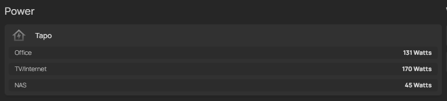

# Tapo Device Power REST API

A lightweight REST API for fetching power data from Tapo smart devices, packaged for Docker deployment.

This project uses [tapo-rest](https://github.com/ClementNerma/tapo-rest) by Clément Nerma as the backend for device communication. The Dockerfile and deployment approach are inspired by the official tapo-rest Docker setup.

My goal was to retrieve data usage for several Tapo smart plugs in 1 single response, to use in a [custom API](https://gethomepage.dev/widgets/services/customapi/) service widget in my [Homepage](https://gethomepage.dev/) dashboard:

### Syntax
```
- Power:
    - Tapo:
        icon: mdi-home-lightning-bolt-outline
        widgets:
            - type: customapi
              url:  http://<taporestsc_url>:5000/get_all_device_power
              refreshInterval: 5000 # in milliseconds
              display: dynamic-list
              mappings:
                    name: device
                    label: data.current_power
                    suffix: Watts
```
### Result


## Features

- REST API endpoint to fetch current power data from all configured Tapo devices
- Dockerized for easy deployment
- Configurable device and API settings via JSON files

## Quick Start

### 1. Clone this Repository

```
git clone <this-repo-url>
cd <this-repo-directory>
```

### 2. Prepare Configuration

- Place your Tapo device configuration in `app/devices.json`.
- Place your API configuration (including tapo-rest URL and password) in `app/config.json`.

### 3. Build the Docker Image

`docker build -t taposc .`

### 4. Run the Container

Example command (adapt to your environment):

`docker run -d -p 5000:5000 -p 5080:80 -e TAPO_EMAIL=your_tapo_email@example.com -e TAPO_PASSWORD=your_tapo_password -e AUTH_PASSWORD=your_auth_password --name tapo taposc`

## API Usage

- **GET `/get_all_device_power`**  
  Returns a JSON list of power data for all configured devices.

- **Default route `/`**  
  Redirects to `/get_all_device_power`.

## Project Structure

```
.
├── app/
│ ├── config.json # API and authentication configuration
│ └── devices.json # List of Tapo devices to monitor
├── taposc.py # Flask REST API application
├── tapo-rest # tapo-rest binary (see below)
├── start.sh # Entrypoint script
├── requirements.txt # Python dependencies
├── Dockerfile # Docker build instructions
└── README.md # This file
```

## tapo-rest Backend

This project bundles the [tapo-rest](https://github.com/ClementNerma/tapo-rest) binary by Clément Nerma, which communicates with your Tapo devices.  
**Note:** This project and tapo-rest are not affiliated with TP-Link/Tapo.

## Configuration

### `app/config.json`

```
{
"tapo_api_url": "http://localhost:80",
"login_password": "your_auth_password"
}
```

### `app/devices.json`

```
{
"devices": [
{
"name": "living-room-plug",
"device_type": "P110",
"ip_addr": "192.168.1.10"
}
// ... more devices
]
}
```

## Python Dependencies

Listed in [`requirements.txt`](requirements.txt):

```
Flask
waitress
requests
```

## Entrypoint Script

[`start.sh`](start.sh):

```
#!/bin/sh

# Start tapo-rest in the background
nohup ./tapo-rest /app/devices.json --port=80 &

# Wait a few seconds to ensure tapo-rest is up
sleep 2

# Start the waitress server
exec waitress-serve --host=0.0.0.0 --port=5000 taposc:app
```

## Credits & Inspiration

- [tapo-rest](https://github.com/ClementNerma/tapo-rest) by Clément Nerma
- Dockerfile and deployment approach inspired by the official tapo-rest Docker setup

---

## License

This project is provided as-is, with no warranty.  
`tapo-rest` is distributed under its own license; see [tapo-rest GitHub](https://github.com/ClementNerma/tapo-rest) for details.
